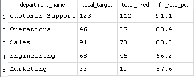
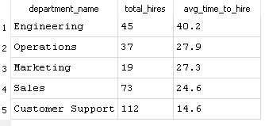
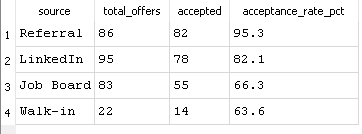
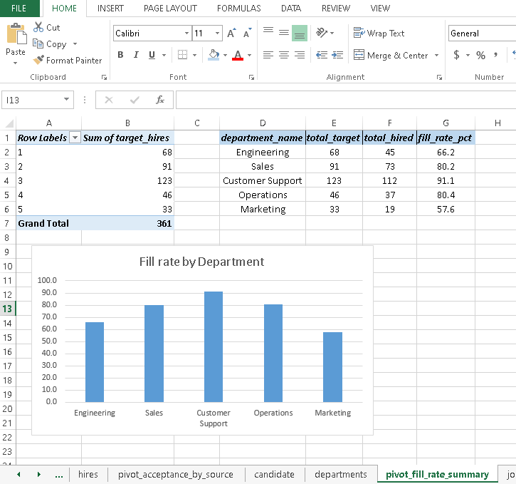
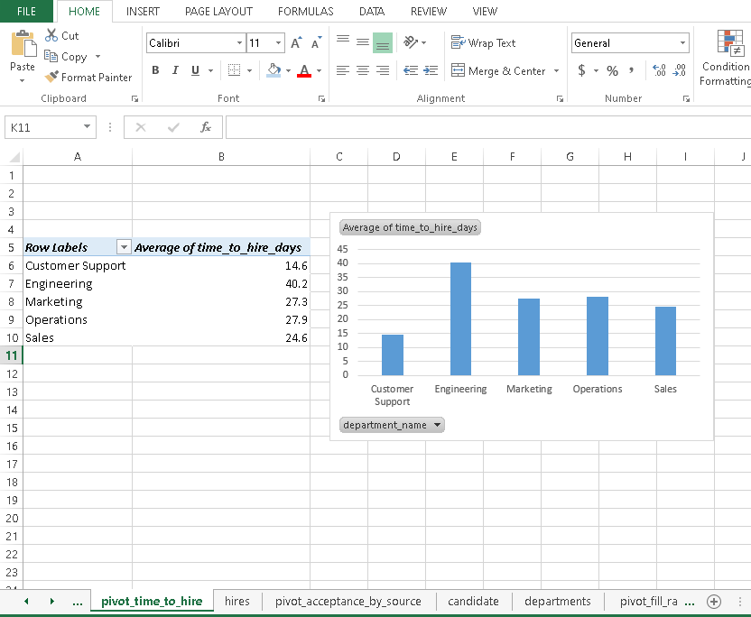
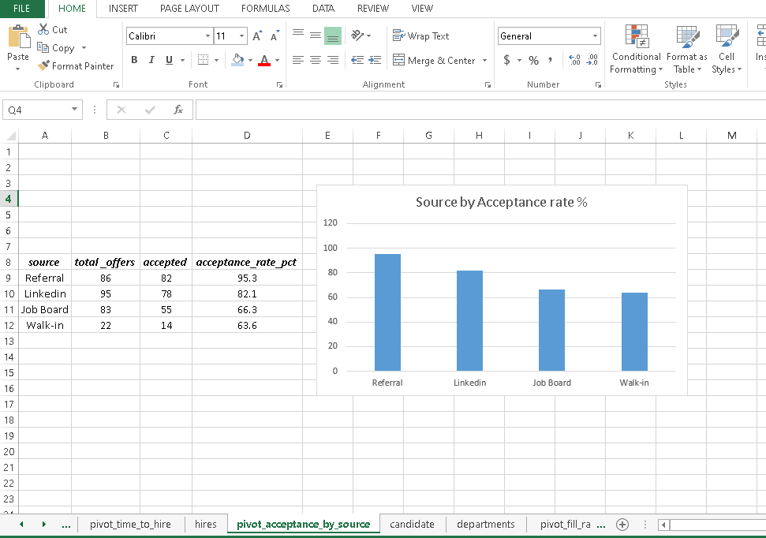
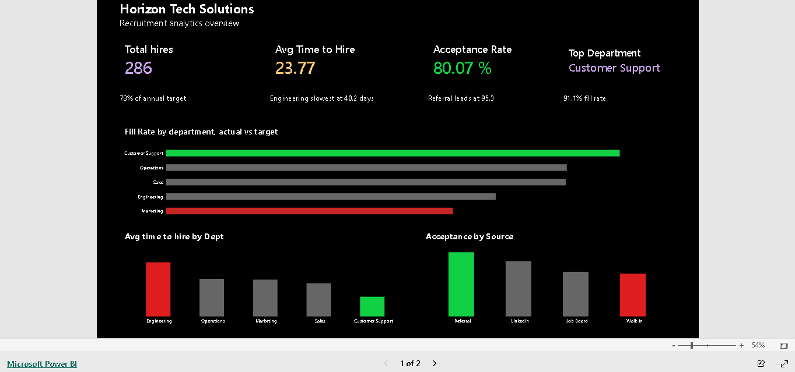
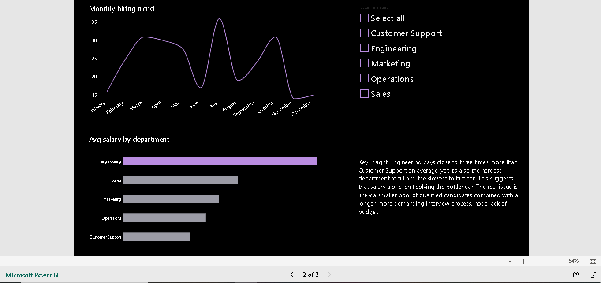

# Horizon Tech Solutions Recruitment Analytics

## Overview
Horizon Tech Solutions is a fictional Nigerian tech company hiring across 5 departments (Engineering, Sales, Customer Support, Operations, Marketing) across 4 locations. This project analyzes hiring performance, time-to-fill trends, and recruitment source effectiveness to identify where the hiring process is working well and where it needs attention.

**Tools used:** SQL (SQLite), Excel, Power BI

## Key Takeaway
*(coming once all parts are done)*

---

## Part 1: SQL

### Q1: Which departments are hitting their hiring targets?

**Query:**
```sql
SELECT 
    d.department_name,
    targets.total_target,
    COALESCE(hire_counts.total_hired, 0) AS total_hired,
    ROUND(COALESCE(hire_counts.total_hired, 0) * 100.0 / targets.total_target, 1) AS fill_rate_pct
FROM departments AS d
JOIN (
    SELECT department_id, SUM(target_hires) AS total_target
    FROM job_openings
    GROUP BY department_id
) AS targets
    ON d.department_id = targets.department_id
LEFT JOIN (
    SELECT j.department_id, COUNT(h.hire_id) AS total_hired
    FROM job_openings AS j
    JOIN candidates AS c ON c.opening_id = j.opening_id
    JOIN hires AS h ON h.candidate_id = c.candidate_id
    GROUP BY j.department_id
) AS hire_counts
    ON d.department_id = hire_counts.department_id
ORDER BY fill_rate_pct DESC;
```

**Result:**


**Insight:** Customer Support has the strongest fill rate at 91.1%, while Marketing lags furthest behind at 57.6%. Engineering sits in the middle at 66.2%, but given how many roles it targets each year, that gap represents a meaningful number of unfilled positions worth investigating further.

---

### Q2: What's the average time-to-hire by department?

**Query:**
```sql
SELECT 
    d.department_name,
    COUNT(h.hire_id) AS total_hires,
    ROUND(AVG(h.time_to_hire_days), 1) AS avg_time_to_hire
FROM hires AS h
JOIN candidates AS c
    ON h.candidate_id = c.candidate_id
JOIN job_openings AS j
    ON c.opening_id = j.opening_id
JOIN departments AS d
    ON j.department_id = d.department_id
GROUP BY d.department_name
ORDER BY avg_time_to_hire DESC;
```

**Result:**


**Insight:** Engineering takes nearly three times as long to fill roles as Customer Support (40.2 days versus 14.6 days). This lines up directly with the fill rate findings from Q1, suggesting that the length of the hiring process itself is a major driver of whether a department hits its targets, not just candidate availability.

---

### Q3: Which recruitment source produces the best offer-acceptance rate?

**Query:**
```sql
SELECT 
    c.source,
    COUNT(h.hire_id) AS total_offers,
    SUM(CASE WHEN h.accepted_offer = 'Yes' THEN 1 ELSE 0 END) AS accepted,
    ROUND(SUM(CASE WHEN h.accepted_offer = 'Yes' THEN 1 ELSE 0 END) * 100.0 / COUNT(h.hire_id), 1) AS acceptance_rate_pct
FROM hires AS h
JOIN candidates AS c
    ON h.candidate_id = c.candidate_id
GROUP BY c.source
ORDER BY acceptance_rate_pct DESC;
```

**Result:**


**Insight:** Referrals convert at a 95.3% acceptance rate, far ahead of LinkedIn (82.1%), Job Board (66.3%), and Walk-in (63.6%). This suggests Horizon Tech could reduce wasted recruiter effort by leaning more heavily on employee referrals rather than splitting budget evenly across all four channels.

In this section, I used SQL to answer 3 core business questions: which departments are hitting their hiring targets, how time-to-hire compares across departments, and which recruitment source produces the best offer-acceptance rate. Each query was written, tested, and verified against the raw data.

---

## Part 2: Excel

After completing the SQL analysis, I moved the raw data into Excel to clean it further, cross-validate my SQL findings using a different tool, and calculate figures that needed data from multiple tables joined together.

**Data Cleaning performed:**
- Traced department information into the hires sheet using a three-step VLOOKUP chain (hires to candidates to job openings to departments), since department was not directly available in the hires table
- Filled 2 missing salary values using each employee's department average, rather than leaving them blank or guessing, since salary is a genuine numeric field where a blank would break any total or average calculation
- Standardized inconsistent location names in job openings (e.g. "PH", "Port-Harcourt" to "Port Harcourt")
- Removed 6 duplicate candidate rows
- Fixed inconsistent date formats in application dates using Format Cells

### 1. Fill Rate by Department
**Steps:** Built a PivotTable to count total hires per department, a second PivotTable to sum target hires per department from job openings, then combined both into a summary table with a calculated fill rate percentage.
**Screenshot:** 
**Insight:** Customer Support has the strongest fill rate at 91.1 percent, while Marketing lags furthest behind at 57.6 percent, matching my SQL findings exactly and confirming the accuracy of both approaches.

### 2. Average Time to Hire by Department
**Steps:** Built a PivotTable with department_name in Rows and time_to_hire_days in Values, set to Average.
**Screenshot:** 
**Insight:** Engineering takes nearly three times as long to fill roles as Customer Support, 40.2 days versus 14.6 days, reinforcing that the length of the hiring process itself is a major driver of whether a department hits its targets.

### 3. Offer Acceptance Rate by Source
**Steps:** Pulled recruitment source into the hires sheet via VLOOKUP, then built a summary table using COUNTIF and COUNTIFS formulas to calculate total offers, accepted offers, and acceptance rate per source.
**Screenshot:** 
**Insight:** Referrals convert at a 95.3 percent acceptance rate, far ahead of LinkedIn at 82.1 percent, Job Board at 66.3 percent, and Walk-in at 63.6 percent, matching my SQL findings exactly and reinforcing that referrals are the most reliable recruitment channel.

In this section, I traced data across multiple linked sheets to bring department and source information into a single working table, handled a genuinely ambiguous missing data case using department averages, and cross-validated every result against my SQL queries. All three Excel findings matched the SQL analysis exactly, confirming the accuracy of both approaches.

## Part 3: Power BI Dashboard

To bring the analysis together for a non technical audience, I built a 2 page interactive dashboard in Power BI Service. I chose a dark charcoal background with a confident purple accent, using green and coral to color code performance, on target departments and sources in green, underperforming ones in coral, so the dashboard communicates meaning through color, not just numbers.

**Live Dashboard:** [View on Power BI](https://app.powerbi.com/view?r=eyJrIjoiYTJmZGRlZDctMTlmYy00YzM2LTgyZjctNDg0NjZiY2JmODA5IiwidCI6ImY2NTY4OGQ1LTAzOGMtNGNjZi1hYTVlLTYzNTljMjY0NTZiMiJ9)

### Page 1: Overview
**Screenshot:** 

This page gives a high level summary for quick decision making:
- 4 key metric cards: Total Hires (286), Avg Time to Hire (23.77 days), Acceptance Rate (80.07 percent), and Top Department (Customer Support)
- A Fill Rate by Department chart, with the strongest department highlighted in green and the weakest in coral
- An Avg Time to Hire by Department chart, using the same highlight pattern
- An Acceptance by Source chart, showing which recruitment channel converts best

**Insight:** Customer Support leads in both fill rate and speed of hiring, while Engineering is the hardest and slowest department to fill despite paying the highest average salary. Referral is the clear leader in offer acceptance, reinforcing the SQL and Excel findings from earlier sections.

### Page 2: Trends and Deeper Analysis
**Screenshot:** 

This page allows deeper, interactive exploration:
- A Monthly Hiring Trend line chart showing a clear slowdown toward the end of the year
- An interactive department slicer, letting users filter the page by individual department
- An Avg Salary by Department chart, a new analysis not covered in the SQL or Excel sections
- A written key insight callout directly on the dashboard

**Insight:** Hiring activity slows sharply in November and December, likely tied to end of year budget cycles and holiday scheduling. Engineering pays close to three times more than Customer Support on average, yet remains the hardest department to fill, suggesting the bottleneck is more about candidate availability and process length than compensation.

In this section, I brought the cleaned data into Power BI Service to build a 2 page interactive dashboard for a non technical audience. Beyond presenting the findings visually, I used a dedicated salary comparison chart to explore whether pay alone explains the hiring difficulty, uncovering a pattern not visible in the SQL or Excel analysis alone.

## Conclusion
*(coming once all parts are done)*
